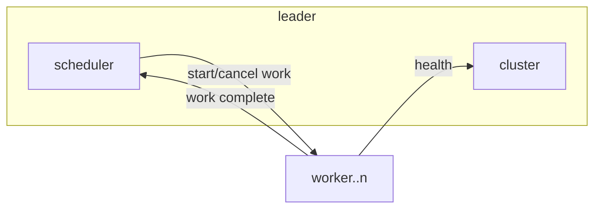

# go-work

This a repository to demonstrate how to have clustor of workers in go.

### Scheduler Design

The Leader performs two main functions: heartbeat management i.e. the health of the workers in the cluster, and scheduling new work based the workers available.



### Useful Commands

List all the operations available on the Leader server.

```sh
grpcurl -plaintext :50051 describe cluster.v1.LeaderService
```

List all the operations available on the Scheduler server.

```sh
grpcurl -plaintext :50052 describe scheduler.v1.SchedulerService
```

Get the list of worker members in the cluster.

```sh
grpcurl -plaintext :50051 cluster.v1.LeaderService.Members
```

Get the list of tasks pushed through the leader.

```sh
grpcurl -plaintext :50052 scheduler.v1.SchedulerService.GetTasks
```

Add a task to the scheduler.

```sh
grpcurl -plaintext -d '{"task": {"id":"1","payload":"do some work"}}' :50052 scheduler.v1.SchedulerService.ScheduleTask
```
