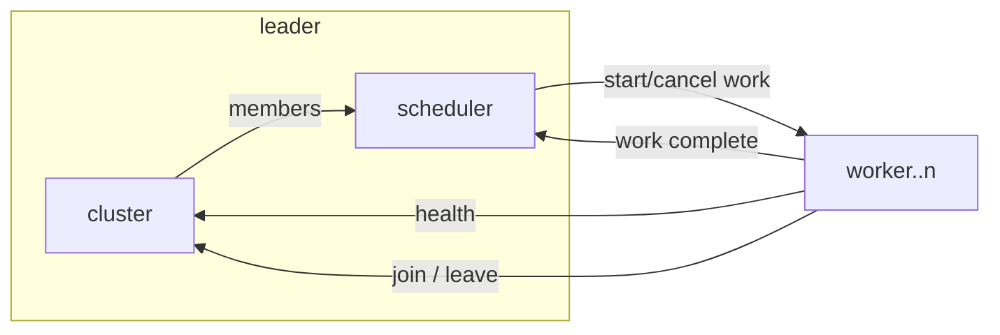

# go-work

This a repository to demonstrate how to have cluster of workers in go.
### Design

The Leader performs two main functions: heartbeat management i.e. the health of the workers in the cluster, and scheduling new work based the workers available.



There are 3 core contracts:

- cluster - the cluster manages joining and leaving the cluster and the health of workers.
- scheduler - the scheduler manages the receiving of work request and the dishing out to the workers.
- worker - the worker receives commands to start (or stop) work, and then reports health and completion of work to the cluster and schedule respectively.

All the communication is over gRPC (non-TLS in this example) using client and server RPC calls (non streaming).

### Testing

The test coverage in the codebase is relatively high, however, there are a few gaps that can be closed, the plan is to close these in the not too distant future.
### Future

- [ ] Writer a CLI interface to get the status of the Scheduler/Cluster server and to request and cancel work as well as see the status of any running tasks
- [ ] Put the comms over mTLS (outside of the implementation code, i.e. NGINX or Envoy)
- [ ] Covert the heartbeat comms between the cluster leader and the members (workers) over a stream
- [ ] Create a consumer library so arbitrary code can act as a worker (a channel to push work in an event like process)
- [ ] There are some TODOs in the code, work to remove them (mainly tests)

### Useful Commands

List all the operations available on the Leader server.

```sh
grpcurl -plaintext :50051 describe cluster.v1.LeaderService
```

List all the operations available on the Scheduler server.

```sh
grpcurl -plaintext :50052 describe scheduler.v1.SchedulerService
```

Get the list of worker members in the cluster.

```sh
grpcurl -plaintext :50051 cluster.v1.LeaderService.Members
```

Get the list of tasks pushed through the leader.

```sh
grpcurl -plaintext :50052 scheduler.v1.SchedulerService.GetTasks
```

Add a task to the scheduler.

```sh
grpcurl -plaintext -d '{"task": {"id":"1","payload":"do some work"}}' :50052 scheduler.v1.SchedulerService.ScheduleTask
```
