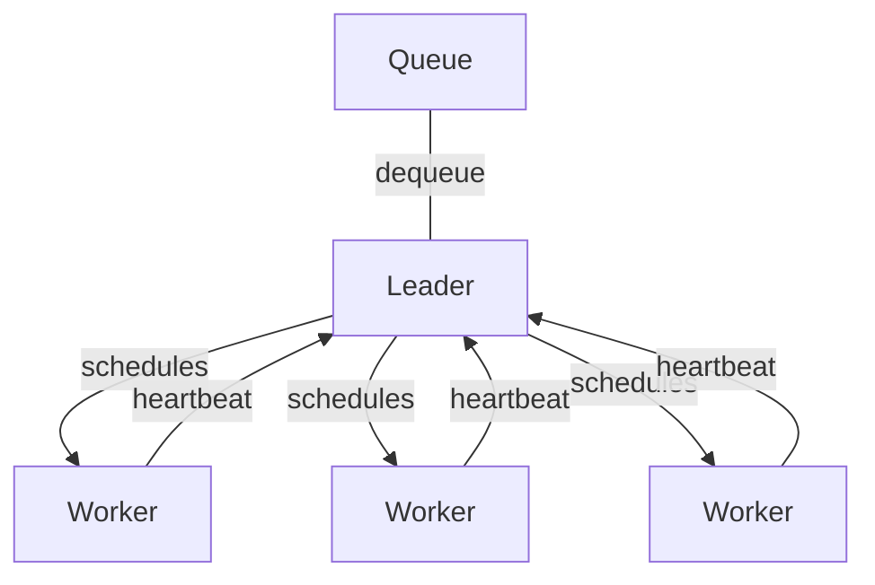

# go-work

This a repository to demonstrate how to have clustor of workers in go.

```mermaid
flowchart TD
Q[Queue]
L[Leader]
W1[Worker]
W2[Worker]
W3[Worker]


Q ---|dequeue| L
L -->|schedules| W1
L -->|schedules| W2
L -->|schedules| W3

W1 --> |heartbeat| L
W2 --> |heartbeat| L
W3 --> |heartbeat| L
```
