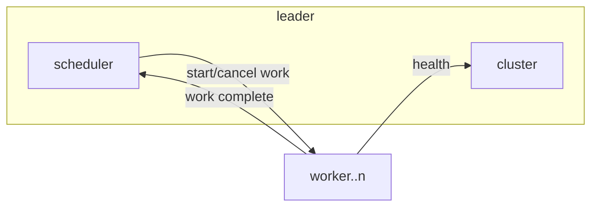

# go-work

This a repository to demonstrate how to have clustor of workers in go.

### Scheduler Design

The Leader performs two main functions: heartbeat management i.e. the health of the workers in the cluster, and scheduling new work based the workers available.

